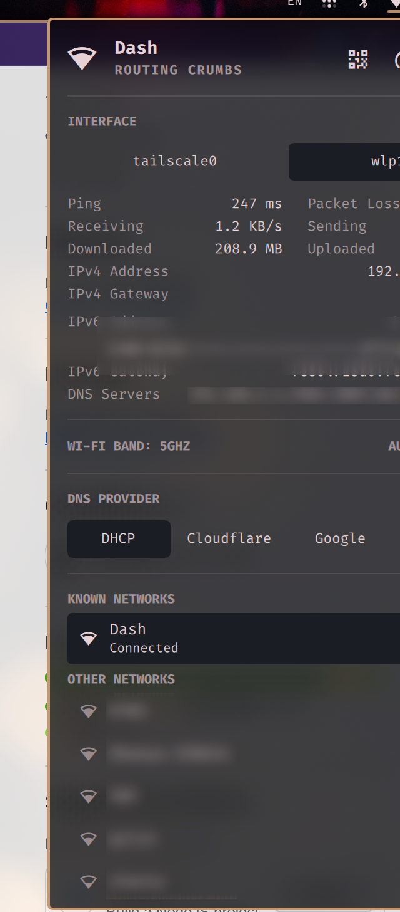

# Network+ (das6ng.network)

Enhanced network bar widget for [Omarchy](https://omarchy.org/), cloned from
the built-in `omarchy.network` panel. Adds full interface/address visibility,
live throughput, and latency stats on top of the stock Wi-Fi list and
connection state.



## What it adds over the stock widget

- **All interfaces** with complete IPv4/IPv6 address lists, operstate, MAC,
  MTU, and per-family default gateways — not just the default route (VPN
  tunnels, docker bridges, etc. included)
- **DNS resolvers in use** — per link plus global, read from systemd-resolved
- **Live throughput** — download/upload rate on the default-route interface
- **Latency stats** — router and internet ping with rolling average and
  packet loss over the last 24 samples
- **IPv6 privacy** — only ISP-global addresses (`2000::/3`) are shown by
  default; ULA and link-local stay behind an explicit reveal, since IPv6
  suffixes can identify the machine (EUI-64/DHCPv6 stability)

## Install

```bash
omarchy plugin add https://github.com/das6ng/omarchy-network-plus.git --enable
```

Enabling replaces the stock network widget in place, in its bar section;
disabling the plugin restores the stock widget. Existing IPC callers keep
working: the panel still answers on the `omarchy.network` target.

## Requirements

All of these ship with a stock Omarchy install:

- NetworkManager
- `jq`, `ip` (iproute2), `ping` (iputils)
- `resolvectl` (systemd-resolved) — optional; the DNS section hides without it

## Notes

- This is a one-time clone: it does **not** track upstream updates to the
  stock `omarchy.network` panel. After major Omarchy shell updates, diff
  against the current stock panel and port changes manually.
- `network-status-all.sh` is invoked with `bash` and resolved relative to the
  plugin directory, so the plugin works under any username or plugin id.

## License

MIT — see [LICENSE](LICENSE). `Panel.qml` and `Model.js` derive from
[Omarchy](https://github.com/basecamp/omarchy) (MIT, © David Heinemeier
Hansson); `network-status-all.sh` is original to this plugin.
